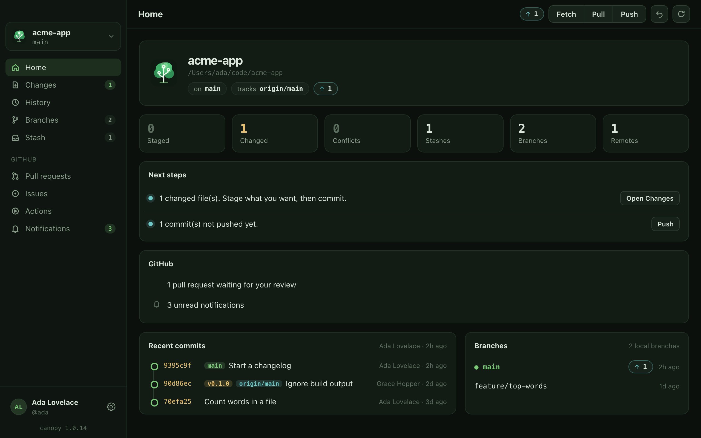
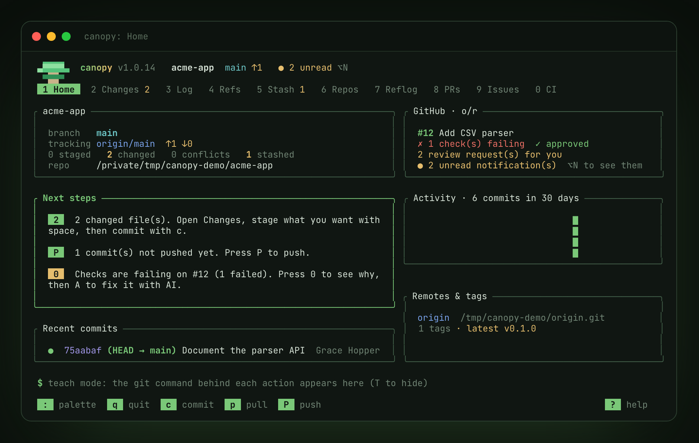

<p align="center"></p>

<h1 align="center">canopy</h1>

<p align="center">
  <a href="https://github.com/shankar-sachin/canopy/actions/workflows/ci.yml"></a>
  <a href="https://github.com/shankar-sachin/canopy/releases/latest"></a>
  <a href="https://github.com/shankar-sachin/canopy/releases"></a>
  <a href="https://github.com/shankar-sachin/homebrew-canopy"></a>
  
  
  <a href="LICENSE"></a>
  <a href="https://shankar-sachin.github.io/canopy/"></a>
</p>

**Git, at a glance.** One canopy, two ways to use it:

- **canopy desktop: start here.** A friendly app for macOS, Windows and Linux. It shows
  your whole repository, explains every term in plain words, gives you a button for the
  next step, asks before anything destructive, and undoes the last commit, reset or checkout.
- **canopy console: everything, from the keyboard.** The power tool: line-level
  staging, interactive rebase, bisect, worktrees, every repository at once, remappable keys
  and your own commands. New power features land here first.

Both run the real `git` and GitHub CLI on your machine and share themes and settings in `~/.canopy`.

**Website:** [shankar-sachin.github.io/canopy](https://shankar-sachin.github.io/canopy/), with a feature tour, the GitHub guide, the full key reference, and a [wiki](https://shankar-sachin.github.io/canopy/wiki/) with a guide for each app.

**canopy desktop**



**canopy console**



## Install

### canopy desktop (start here)

A release preview for macOS, Windows and Linux:

```sh
brew install --cask shankar-sachin/canopy/canopy-desktop   # macOS
winget install shankars.canopy-desktop                     # Windows 11
```

Or get a `.dmg`, installer, `.deb` or AppImage from
[Releases](https://github.com/shankar-sachin/canopy/releases). It isn't notarized by Apple, and won't be, so macOS asks you to
confirm the first time you open it. [More →](https://shankar-sachin.github.io/canopy/desktop.html)

### canopy console

```sh
brew install shankar-sachin/canopy/canopy
```

Or, without Homebrew (macOS and Linux, x86_64 and ARM64; installs to `~/.local/bin` and verifies the checksum):

```sh
curl -fsSL https://raw.githubusercontent.com/shankar-sachin/canopy/main/scripts/install.sh | sh
```

Or build from source (stable Rust):

```sh
cargo install --locked --path crates/canopy
```

canopy needs `git` on your `PATH`.

**On Windows** (x64 and Arm), with winget (installs git too):

```powershell
winget install shankars.canopy
```

or with the install script, in PowerShell:

```powershell
irm https://raw.githubusercontent.com/shankar-sachin/canopy/main/scripts/install.ps1 | iex
```

or download `canopy-<version>-x86_64-pc-windows-msvc.zip` (or `aarch64-…` for Arm) from
[Releases](https://github.com/shankar-sachin/canopy/releases) and put
`canopy.exe` on your `PATH`.
Windows Terminal is recommended. Full steps are on the
[website](https://shankar-sachin.github.io/canopy/get-started.html#windows).

## Use canopy console

<!-- Recorded with vhs from demo.tape (in a throwaway demo repository): vhs demo.tape -->


```sh
canopy                 # open the repo you're in
canopy ~/code/project  # open a specific repo
canopy -w ~/code       # workspace view: every repo under ~/code
canopy ~/code/new-app  # not a repository yet? canopy offers to create one (and connect GitHub)
```

| Tab | What it shows |
| --- | --- |
| **1 Home** | Branch and sync status, "next steps" suggestions, recent commits with a graph, activity, branches |
| **2 Changes** | Staged / unstaged / conflicted files with a live diff. Stage files, hunks, or single lines |
| **3 History** | Commit graph with search. Checkout, cherry-pick, revert, reset, tag, fixup, interactive rebase |
| **4 Branches** | Branches, tags, remotes, worktrees, and submodules (`[` / `]` to switch). Checkout, create, rename, delete, merge, rebase; tag and push tags; add and edit remotes; open a branch in its own worktree folder |
| **5 Stash** | Apply, pop, drop, and preview stashes |
| **6 Workspace** | Every repo in your workspace dirs: branch, dirty state, sync. Open any, or fetch them all |
| **7 Reflog** | Everywhere HEAD has been: your safety net for recovering anything |
| **8 Pull requests** | GitHub PRs (open / mine / review requested / all) with checks and reviews. Check out, create, review, comment, merge, close, open in the browser. Needs the [GitHub CLI](https://cli.github.com) logged in |
| **9 Issues** | GitHub issues (open / assigned to me / all) with labels and comments. Create, comment, close / reopen, open in the browser |
| **0 Actions** | GitHub Actions runs for this branch or all branches, updating live while they run. Jobs, failing steps, and the tail of the failed log; re-run failed jobs |

### Keys

Press `?` on any screen for its keys, or `:` to search every action by name.

| Key | Action | | Key | Action |
| --- | --- | --- | --- | --- |
| `1`–`9`, `0`, `tab` | switch tabs | | `c` | commit |
| `j`/`k`, `↑`/`↓` | move | | `A` | amend last commit |
| `space` | stage / unstage | | `P` / `p` / `f` | push / pull / fetch |
| `⏎` | open diff (then `space` = line, `⏎` = hunk, `v` = range) | | `S` | stash changes |
| `a` | stage / unstage all | | `z` | **undo** last commit, reset, or checkout |
| `d` | discard (asks first) | | `!` | run any git command |
| `/` | filter the list | | `T` | toggle teach mode |
| `L` | history of a file (follows renames) | | `B` | blame: who changed each line |
| `b` | bisect: find the commit that broke something | | | |
| `:` or `ctrl-p` | command palette | | `ctrl-t` | cycle theme |
| `⌃Q` / `⌥Q` | quit, from anywhere (even in a dialog) | | `⌥1`…`⌥0` | jump to a tab |
| `⌥←` / `⌥→` | previous / next tab | | `⌥C` `⌥P` `⌥⇧P` | commit, pull, push |

⌃ is Control and ⌥ is Option (Alt on other keyboards). On macOS canopy shows
keys this way; on Linux it shows `ctrl-q` / `alt-q` (set `mac_key_symbols` to choose).

### Made for learning git

- **Teach mode** (on by default): the footer shows the exact `git` command
  behind every action, so you pick up git as you go. Toggle it with `T`.
- **Next steps** on Home tell you, in plain language, what state you're in and
  which key moves you forward: staged files to commit, commits to push, a merge
  in progress.
- **Confirmations** explain what a destructive action will throw away.
- **Undo** (`z`) reverses the last commit (your changes come back staged), reset,
  merge, or checkout, using the reflog.

## Configure

`~/.canopy/config.toml` (run `canopy --example-config` for a template):

```toml
theme = "canopy"            # canopy | catppuccin | gruvbox | nord | light
nerd_font = false
teach_mode = true
confirm_destructive = true
compact = false             # true: tighter layout, no gaps between panels
splash = true               # the tree animation when canopy starts (any key skips)
workspace_dirs = ["~/code"]
workspace_depth = 3

# Remap any action by its snake_case name (see the full list with `?`).
# A remapped key is taken away from whatever used it before, and canopy
# warns you if that leaves an action without a key.
[keys]
toggle_stage = "s"
commit = ["c", "ctrl-s"]

[[custom_commands]]
key = "X"
cmd = "git push --force-with-lease"
description = "force push (safely)"
confirm = true
```

## How it works

canopy runs the real `git` binary and parses its machine-readable output
(`status --porcelain=v2 -z`, `for-each-ref`, custom `log` formats). Your hooks,
config, credential helpers, and signing all behave exactly as they do on the
command line. Line staging builds a minimal patch and applies it to the index
with `git apply --cached`.

```
crates/canopy-git     git runner, parsers, typed operations (no UI)
crates/canopy-gh      GitHub through the gh CLI
crates/canopy-config  themes and settings shared by both apps
crates/canopy         canopy console (Ratatui): app loop, screens, keymap, themes
crates/canopy-gui     canopy desktop (Tauri; plain HTML/CSS/JS front end)
```

## Roadmap

- [x] Full git dashboard (v1)
- [x] GitHub pull requests and issues via `gh`
- [x] GitHub Actions runs
- [x] The canopy wiki, the logo, a startup animation, and a roomier layout (v0.4)
- [x] More GitHub: notifications, releases, inline review comments, a CI log viewer, and Windows builds (v1.0)
- [x] canopy desktop for macOS, Windows and Linux (v1.0.2–1.0.3)
- [x] Start a new repository, Fix with AI, your own themes (v1.0.4–1.0.7)
- [x] Desktop to start, the terminal for power: plain-language help in the desktop app (v1.0.8)
- [x] Notifications in both apps, bug fixes and a full audit with many more tests (v1.0.10–1.0.12)
- [x] Syntax-highlighted diffs and live refresh (v1.0.13)
- [x] The wiki, rewritten as two guides (canopy desktop, canopy console), with new pages on syncing, the stash, ignoring files and tags; the terminal app is now called canopy console (v1.0.14)
- [x] An audit, safer links in canopy console, and plain words that the Mac app is not notarized (v1.0.15)
- [x] Diff file names fixed (spaces, tabs, accents), a Code of Conduct, and a wiki mirror script (v1.0.16)
- [x] A routine audit of the whole repo, with no code changes (v1.0.17)
- [x] Conflict editor with per-conflict ours/theirs
- [x] File history and blame
- [x] Worktrees
- [x] Bisect
- [x] Submodules

## Website

The site lives in `docs/` and is served by GitHub Pages from `main`. Its
screenshots and key reference are rendered from the real app:

```sh
cargo test -p canopy-git-tui export_site_screens -- --ignored
```

## Develop

```sh
scripts/check.sh      # fmt + clippy + every Rust test, with a one-line verdict
scripts/test-ui.sh    # the desktop app's JavaScript: syntax, then its tests (Node, no npm)
scripts/audit.sh      # everything: check.sh, test-ui.sh, the website audit, versions
scripts/screens.sh    # regenerate the website's screenshots and key tables
CANOPY_PRINT=1 cargo test -p canopy-git-tui ui_tests -- --nocapture   # print rendered frames
```

| Script | What it does |
| --- | --- |
| `scripts/install.sh` | Install a release on macOS/Linux (`… \| sh -s -- v1.0.0` for a version, `--uninstall` to remove) |
| `scripts/install.ps1` | The same for Windows (`-Version`, `-Uninstall`) |
| `scripts/check.sh` | Formatting, clippy with warnings as errors, and all Rust tests |
| `scripts/test-ui.sh` | Syntax-check every script, then run the desktop UI tests in `crates/canopy-gui/ui-tests` (Node 20+) |
| `scripts/audit-site.mjs` | Audit the website: links and anchors, page titles and descriptions, alt text, the search index, the changelog's version |
| `scripts/audit.sh` | The full audit before a release: all of the above, plus version and shell-script checks (`--quick` skips the Rust step) |
| `scripts/test-map.sh` | Where the tests are: counts per crate, untested files and git operations |
| `scripts/screens.sh` | Re-render the docs screenshots, keys and theme tables from the real TUI |
| `scripts/release.sh` | Run the audit, tag the version in `Cargo.toml`, publish the release as you, wait for the builds, and check the Homebrew tap |

Release: bump `version` in `Cargo.toml` in a PR, merge it, then run
`scripts/release.sh` on main. CI builds the binaries, attaches them to the
release, and updates the Homebrew tap.

## Code of conduct

Be kind. Everyone taking part follows the [Code of Conduct](CODE_OF_CONDUCT.md).

## Security

Found a security problem? Please report it privately, not in an issue: see
[SECURITY.md](SECURITY.md).

## License

MIT. The open source packages canopy is built from, and their licenses, are listed in
[THIRD-PARTY-LICENSES.txt](THIRD-PARTY-LICENSES.txt) (also inside every download).
